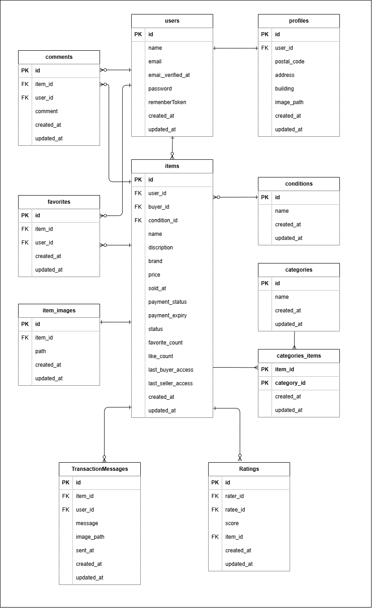

# TestFleaMarket(模擬案件フリマサイト)

## 概要
模擬案件フリマサイト

## 環境構築
**Stripe CLI環境構築およびDockerビルド**
1. `git@github.com:KOU-jpg/app-laravel.git`
2. [Stripeダッシュボード](https://dashboard.stripe.com/)にログインし、開発者」→「APIキー」から`STRIPE_SECRET_KEY`（シークレットキー）を取得
3. ターミナルで以下を実行し、Stripe CLIをインストール（未インストールの場合）
   [公式ダウンロードページ](https://stripe.com/docs/stripe-cli#install)を参照してください
4. Stripe CLIでWebhookシークレットを取得
ダウンロードしたzipを解凍し、Stripe CLIの実行ファイルが存在するディレクトリ（カレントディレクトリ）で、下記コマンドを実行してください。
``` bash
 ./stripe listen --forward-to http://localhost:4242/stripe/webhook
```
を実行すると`whsec_...`というWebhookシークレットが表示されます。
5. プロジェクトルートに`.env`ファイルを作成し、下記のように記載
STRIPE_SECRET_KEY=sk_test_xxxx # 1で取得したシークレットキー
STRIPE_WEBHOOK_SECRET=whsec_xxxx # 3で取得したWebhookシークレット
6. DockerDesktopアプリを立ち上げる
7. `docker-compose up -d --build`

> *MacのM1・M2チップのPCの場合、`no matching manifest for linux/arm64/v8 in the manifest list entries`のメッセージが表示されビルドができないことがあります。
エラーが発生する場合は、docker-compose.ymlファイルの「mysql」内に「platform」の項目を追加で記載してください*
``` bash
mysql:
    platform: linux/x86_64(この文追加)
    image: mysql:8.0.26
    environment:
```

**Laravel環境構築およびMailhog環境構築**
1. `docker-compose exec php bash`
2. `composer install`
3. 「.env.example」ファイルを 「.env」ファイルに命名を変更。または、新しく.envファイルを作成
4. .envに以下の環境変数を追加
``` text
DB_CONNECTION=mysql
DB_HOST=mysql
DB_PORT=3306
DB_DATABASE=laravel_db
DB_USERNAME=laravel_user
DB_PASSWORD=laravel_pass

MAIL_MAILER=smtp
MAIL_HOST=mailhog
MAIL_PORT=1025
MAIL_USERNAME=null
MAIL_PASSWORD=null
MAIL_ENCRYPTION=null
MAIL_FROM_ADDRESS=no-reply@example.com
MAIL_FROM_NAME="【模擬案件フリマアプリ】メール認証"
```
5. アプリケーションキーの作成
``` bash
php artisan key:generate
```

6. マイグレーションの実行
``` bash
php artisan migrate
```

7. シーディングの実行
``` bash
php artisan db:seed
```

## 使用技術(実行環境)
- PHP7.4.9
- Laravel8.83.29
- MySQL8.0.26
- Nginx 1.21.1
- phpMyAdmin（latest）
- MailHog（latest）
- Stripe CLI（latest）

## ER図


## URL
- 開発環境：http://localhost/
- phpMyAdmin:：http://localhost:8080/
- SMTPサーバー: localhost:1025
    - アプリのメール送信設定で使用
- Web UI: http://localhost:8025/
    - ブラウザでアクセスし、送信されたメールを確認
# app-laravel
# FleaMarketApp
=======
>>>>>>> 269fa9189044c1f7e237dd227241cf104195f217
# FleaMarketApp

composer require stripe/stripe-php
